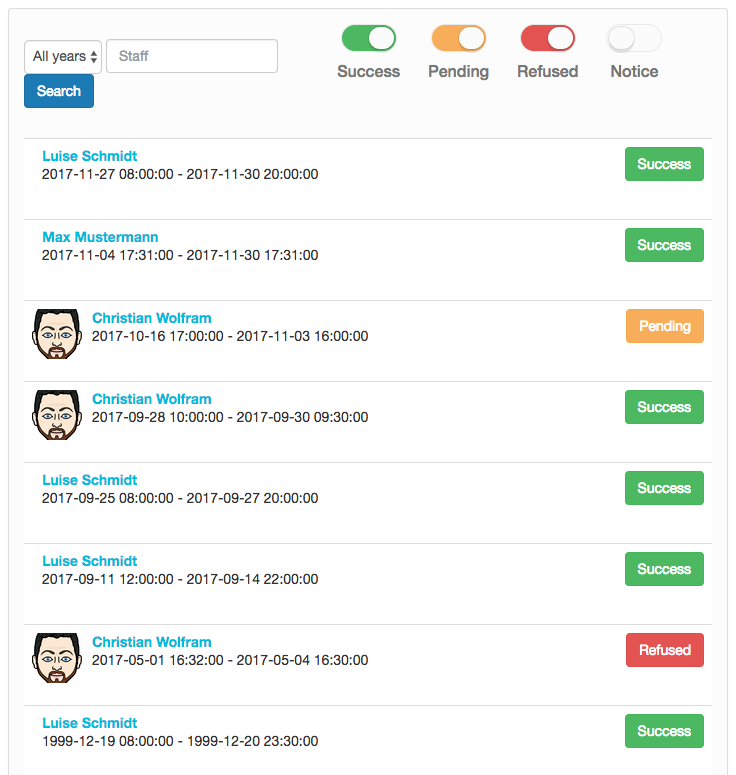
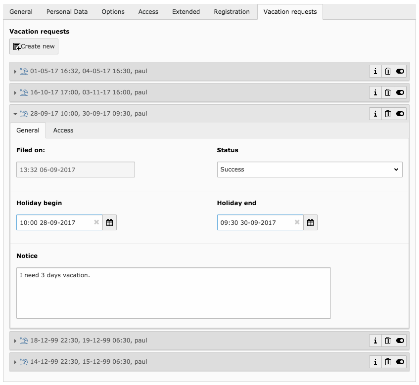

# TYPO3 Extension ``staffholiday``

## Features

- Based on extbase & fluid, implementing best practices from TYPO3 CMS
- Frontend template based on Twitter Bootstrap (v3) 
- (Well documented)[1]

## Usage

### 1) Installation

#### Installation using Composer

The recommended way to install the extension is by using (Composer)[2]. In your Composer based TYPO3 project root,
just do `composer require chriwo/staffholiday`. 

#### Installation as extension from TYPO3 Extension Repository (TER)

Download and install the extension with the extension manager module.

## Screenshots

[1]: https://docs.typo3.org/typo3cms/extensions/staffholiday/
[2]: https://getcomposer.org/ 
